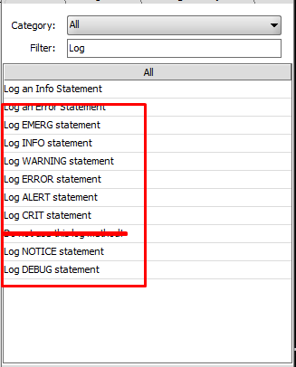

# Gelf Messages adapter for Mirth
### NB! This plugin was originally not intended for common use. It is heavily leaned towards my personal need and probably will most likely receive no updates. This repository is purely for proof-of-concept

---
### Logstash-gelf
Copy [logstash-gelf](https://github.com/mp911de/logstash-gelf) jarfile to `/opt/mirthconnect/server-launcher-lib/`

---
### Log4j.properties sample
```properties
# graylog appender
log4j.appender.graylog=biz.paluch.logging.gelf.log4j.GelfLogAppender
log4j.appender.graylog.OriginHost=mirth-connect.server.com
log4j.appender.graylog.Host=tcp:graylog.server.com
log4j.appender.graylog.Port=13202
log4j.appender.graylog.Version=1.1
log4j.appender.graylog.ExtractStackTrace=false
log4j.appender.graylog.FilterStackTrace=false
log4j.appender.graylog.IncludeLocation=false
log4j.appender.graylog.MdcProfiling=false
log4j.appender.graylog.Facility=none
log4j.appender.graylog.Threshold=ERROR
log4j.appender.graylog.IncludeFullMdc=true
log4j.appender.graylog.MaximumMessageSize=8192
log4j.appender.graylog.TimestampPattern=yyyy-MM-dd HH:mm:ss,SSS
```

###Logging code template library
[Code template library](util/codeTemplateLib.xml) is available in util folder.

**Use the new functions, they add channel and message data to GELF message**



### Configuration map variables
**Plugin requires a minimum of three entries:**

| Key               | Default     | Description     |
| -----------       | ----------- | ----------- |
| GlConfigPrefix    | `GL.`         | Prefix for all keys related to GraylogAdapter |
| GL.environment    | `TEST`        | Current environment |
| GL.program        | `NextGen Connect` |  |
Every key, that has the aforementioned prefix is sent in the GELF message, but without the prefix. For example `GL.program` and `GL.environment` fields will be sent as `program` and `environment`.

---
### Note
This plugin uses [Mirth Maven Plugin](https://github.com/kpalang/mirth-plugin-maven-plugin) for `plugin.xml` generation
